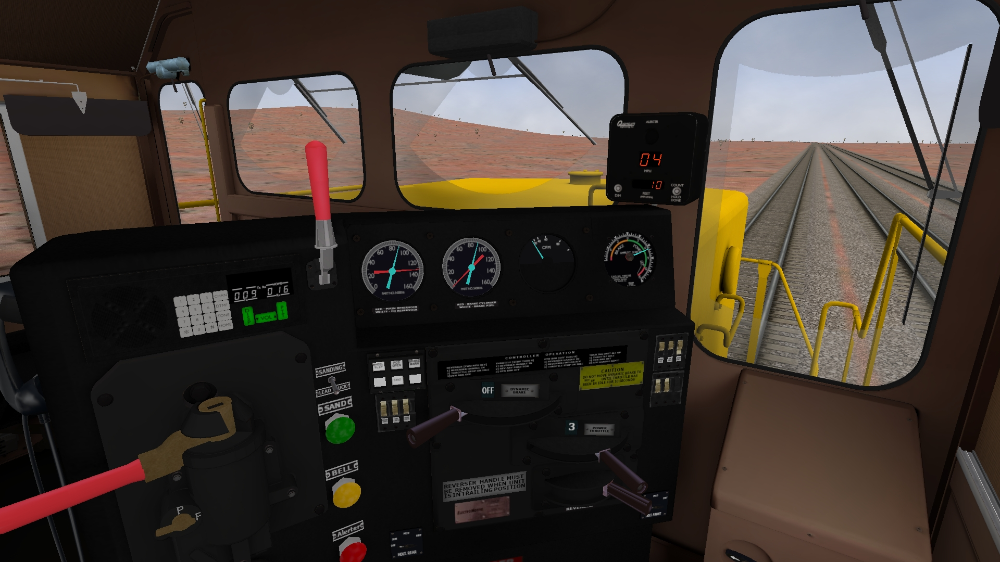

## Generic SD40-2 with 3D cab view for Open Rails

### If you just want the download for Open Rails.

- Download the generic_SD40-2.zip file in the list above.

- Browse to the download location on your computer and extract the contents of the downloaded zip file into a temp folder.

- Browse to that temp folder and copy or move the 'generic_SD40-2' folder into the TRAINSET folder where you keep your Open Rails rolling stock.  If you store your MSTS rolling stock in this folder be warned that the eng file in this download may cause MSTS to crash.  Test MSTS to ensure it is OK. 

- Use your consist editor of choice to add the 'generic sd40-2' loco to a new or existing consist.

- There are 2 consists provided in the CONSISTS folder that have 2 different cab view configurations.

- Test in Open Rails.

###  Information for content creators

This model has been used as a test bed for different modelling / texturing techniques. This model has dimensional inaccuracies, it is missing details, it is not optimised and it is not best practice. However, it does export from Blender and work in Open Rails v1.5.1 on my computer. 

I have other commitments and projects that demand my time leaving little for this work.  Rather than letting them waste away on my computer, these models are being being made public on github as they may be useful to others.  Use them, abuse them, rob them for parts and redistribute as you desire.  

The SOURCE folder contains Blender v3.6.0 and GIMP v2.10 source files for the locomotive and the gauges that were used for rendering textures.  

The drawings were kindly contributed by Nathan and are included in the DRAWINGS folder.

The 3D cab view has 2 seat options. Digital or analog speedometer.  With or without external body.  In the CABVIEW3D folder for the locomotive, there are 8 .S files with different combinations of cab views.  

These different combinations are quick to configure and export from Blender by renaming collections as well as moving objects within collections.

Currently the Blender file is configured to export just the 3D cabview without external body.  To export the external model, rename the collection called MAIN to MAIN_3DCABVIEW or whatever makes sense to you.  Then rename the MAIN_SD40-2_EXTERNAL collection to MAIN and export from Blender.

In addition to the 'normal' locomotive controls, the 3D cab view has animated front door, driver's windows, wipers, alerter and some switches. 

### Known issues and general information

There a many issues and I keep finding new ones.  

The 3D cab view and external model where not built together.  When I merged them recently into a single Blender file for this project, I found that modelling by eye is not as accurate as modelling to known dimensions, which I did not have at the time. 

The textures, texture layout and UV unwrap is a quick and dirty hack, is not well thought out and needs a complete overhaul.  This probably not a bad thing as the geometry or needs to be accurate first, then new textures can be rendered or baked once unwrapped correctly.

Objects like chains, handrail ends, bogie and under frame details are missing.

Objects like horns, lights, handles are simple geometry place holders.

There is no 2D cab view. There is no sound. The external model has no animations. 

The physics files for OR need to be looked at.  I have based these on information that Peter, Gerry and Eric have made available to the community.  I thank them for this work. I have tweaked them and in doing so I broke them.

Add your issues to the list and see if someone can fix, replace or enhance.

### Hopes, dreams, aspirations and ramble

There have been occasional mentions in the Open Rails forums of a 'default' locomotive and 'generic' 3D cab views like those created for MSTS.  This project is my attempt to seed a reference locomotive for Open Rails.  

The SD40-2 is a good choice as 1000's have been built, and are used throughout the world.  They are in preservation so detailed reference gathering is possible.  There is a commonality of parts so if a library of 3D objects are created, different variants of GP/SD type locomotives can be boiler plated together for faster development and customisation.  

From highly detailed reference models, textures can be rendered and lower poly models derived for use in any simulation.

Both humans and AI find assembling from parts is often easier than building from scratch.

The CC0 1.0 Universal licence ensures this is for the benefit of all.

Cheers,

Marek.

Contact superheatedsteam at https://www.elvastower.com, https://www.trainsim.com forums or @yahoo.com.